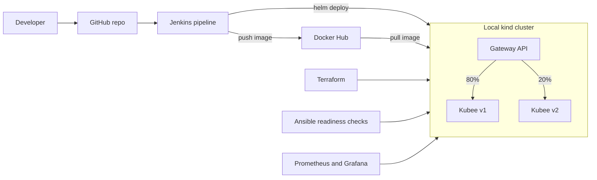

# Kubernetes Delivery Platform

An end-to-end project that takes a small web app from code to a running, monitored release on Kubernetes. A Git push triggers a Jenkins pipeline that tests, builds, and deploys the app with Helm. Terraform creates the local Kubernetes cluster, Ansible checks the cluster is ready before delivery, Gateway API splits traffic between two versions (an 80/20 canary release), and Prometheus and Grafana monitor everything.

The app being delivered is **Kubee**, my animated resume site. I built this platform to put hands-on, end-to-end practice behind the tools I learned on my own (Terraform, Jenkins, Helm, Ansible), alongside my professional Kubernetes operations experience.

> **Status:** in progress. See the [phase checklist](#project-status) below.

## Architecture



## Tech stack

| Area | Tools |
|---|---|
| Application | Python, Flask, pytest |
| Containers | Docker, Docker Hub |
| Orchestration | Kubernetes (kind), Helm |
| Infrastructure as code | Terraform |
| CI/CD | Jenkins |
| Traffic management | Gateway API (80/20 canary) |
| Readiness checks | Ansible |
| Monitoring | Prometheus, Grafana |

## Repository structure

```
.
├── app/            # Flask app, static site, tests, Dockerfile, raw manifests
├── helm/           # Helm chart for the app
├── terraform/      # Terraform for the local cluster and installs
├── ansible/        # Readiness check playbook
├── jenkins/        # Jenkinsfile and Jenkins setup notes
└── monitoring/     # Prometheus and Grafana configuration
```

## Project status

- [x] **Phase 1:** App, Docker image, local cluster with kind
- [ ] **Phase 2:** Helm chart and local Jenkins pipeline
- [ ] **Phase 3:** Terraform creates the local cluster and installs components
- [ ] **Phase 4:** Pipeline deploys to the cluster, Gateway API 80/20 canary, Ansible readiness checks
- [ ] **Phase 5:** Prometheus, Grafana dashboard, and an alert
- [ ] **Phase 6:** Documentation, demo recording, final cleanup

## Prerequisites

- Docker Desktop, kubectl, kind, Git, Python 3
- Later phases: Terraform, Helm, Ansible

## Quick start (Phase 1: run locally)

**Run the app:**

```bash
cd app
python3 -m venv venv
source venv/bin/activate
pip install -r requirements.txt
python app.py
```

In another terminal:

```bash
curl localhost:8080/health
curl localhost:8080/version
```

Then open http://localhost:8080 in a browser.

**Run the tests:**

```bash
cd app
pytest
```

**Build and run the container:**

```bash
cd app
docker build -t delivery-app:v1 .
docker run -p 8080:8080 delivery-app:v1
```

**Deploy to a local kind cluster:**

```bash
kind create cluster --name dev
kind load docker-image delivery-app:v1 --name dev
kubectl apply -f app/manifests/deployment.yaml
kubectl port-forward svc/delivery-app 8080:80
```

## Later phases

Instructions for Helm, Jenkins, Terraform, the canary release, and monitoring will be added here as each phase is completed.

## Where this ran

Everything runs locally on a kind cluster on a MacBook Air (M1). No cloud resources are used, so there is no cloud cost. _Update this section if that changes._

## Screenshots

_Add: Jenkins pipeline run, 80/20 traffic split output, Ansible readiness check result, Grafana dashboard, and the alert firing._

## What I learned

_Add 3 to 5 real lessons, including at least one thing that broke and how you fixed it._

## Author

Sravani Ella | Cloud Engineer | [LinkedIn](https://www.linkedin.com/in/sravani-ella) | [GitHub](https://github.com/Sravani205)
